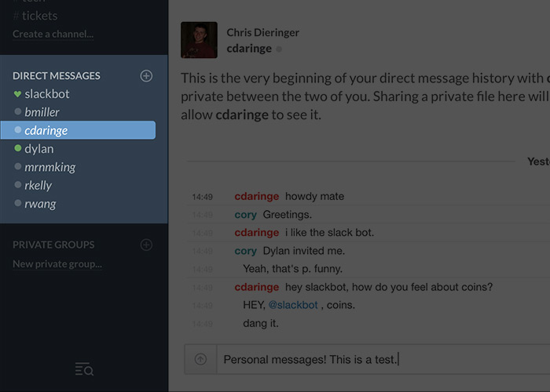

# Intro to [Slack](https://slack.com)

_All the basics for the messaging app for teams._

## Getting Started

You’ll need an invite from your team, or you’ll need to [sign up for an account](https://slack.com/#video_form).

Slack has an in-browser client, but it’s recommended you use their applications:

* [Mac app](https://itunes.apple.com/app/slack/id803453959?ls=1&mt=12)
* [iOS app](https://itunes.apple.com/app/slack-app/id618783545?ls=1&mt=8)
* [Android app](https://play.google.com/store/apps/details?id=com.Slack)
* Windows app (see Step #5 on the [Getting Started page](https://slack.com/getting-started))

## Features

### Channels

The meat and potatoes of Slack. Channels are chat “rooms” that anyone can join.

They’re effortless to create and subscribe/unsubscribe from.

#### Using Channels

Ideally, channels move messages into a semantically appropriate location. Channels are most useful when they adhere to a specific topic or discipline. [Slack suggests](https://slack.com/getting-started):

> Quickly, you'll figure out the right channels for your team. When lots of messages get posted about a specific subject (whether that's a project like 'product redesign,' a topic like 'marketing' or group like 'engineering'), create a new channel and invite people to join it. Letting the channels emerge is more successful than trying to figure it all out before you get started (and potentially end up with tumbleweeds in empty channels).
>
> You'll end up with a nice, focused group of conversations in Slack that are all valuable to your team.

Teams I’ve been on usually set up:

* **#announcements:** press releases, new clients, project launches.
* **#design:** channel for general design discussion, inspiration, UX articles, etc.
* **#development:** for general dev discussion, code questions, git tips, etc. GitHub notifications (for commits to `master`, new PRs, etc.) can be wired up to this channel, but they’re chatty and probably more appropriate elsewhere.
* **#marketing:** channel for planning organization-wide promotion efforts. In a more consumer-facing company, this can be wired up to show Twitter mentions and replies, Instagram likes, etc.
* **#support:** for support tickets (ex: Zendesk) and performance warnings (ex: New Relic). The channel allows for discussing who handles tickets and performance issues or outages. (New Relic has really good Slack integration to where you can click a link into their UI and acknowledge the issue.)

### Direct Messages

One-on-one chat.

### Private Groups

Private groups are exactly what they sound like: chat groups with only the people you want in them. They’re easy to set up:

_(Use lowercase letters and no spaces in the title.)_

Private groups are useful for discussing specific projects or tasks that only a few people need to be a part of.

### Media

You can drag-and-drop an files directly into Slack and they’ll upload. Here’s what an image looks like:

Slack displays several types of media _inline_, meaning a concise summary of the content appears directly in the feed.

Slack is also smart about URLs. You can add links to websites, tweets, pull requests, Google docs – just about anything – and Slack will inline it. Here’s what a a gist looks like:

### Search

One of Slack’s core features is its search. You can easily search _everything_ from the top right search bar:

_(Slack only keeps 10,000 messages on record for teams on the free plan. The [standard plan](https://slack.com/pricing) offers unlimited message store.)_

### Integrations

You’ve probably heard that Slack [integrates with other services](https://slack.com/integrations). These allow other services to interface with Slack. A few useful examples:

* **GitHub:** Have GitHub post a message to a Slack channel when a pull request is opened, when particular branches are merged, when a commit is pushed, etc. The setup can be fine-grained.
* **Asana:** Post new tasks as a message to a Slack channel, send a message to a channel when a task is completed, etc.
* **New Relic:** Set up notifications that post a message to a Slack channel when a server is unreachable, when memory use becomes high, etc.

Slack also exposes [an API](https://api.slack.com), so just about anything is possible with a little custom code.

## Preferences

Customize your experience. It’s important!

### App-Level

#### Notifications

Adjust application-level notifications. You can also tell Slack to fire off a notification when a keyword occurs in a channel. Slack automatically adds your username as a keyword.

I recommend muting sounds via this pane.

#### Message displays

You can adjust, predictably, the display of messages. The “Compact” option is nice.

#### Sidebar Theme

Spice things up by changing the color theme of the sidebar. You can even [add completely custom colors](https://slack.zendesk.com/hc/en-us/articles/205166337-Customizing-your-Slack-theme). [Slackthemes.net](http://slackthemes.net/) has some nice ones.

#### Media & Links

Turn off inline media. Useful if you find it annoying.

### Channel Notifications

You can customize notifications on a per-channel basis. This is useful if you want to be a part of a channel but you find its activity to be too distracting.

## Pro Tips

* Slack has [several commands](https://slack.zendesk.com/hc/en-us/articles/201259356-Using-slash-commands) that you enter in the input area with `/[command]`. A few good ones: `/collapse` collapses a channel’s inlined media, `/away` sets your status to “away,” and `/shortcuts` displays the keyboard shortcuts
* `Command` + `K` opens the quick switcher. Easily navigate between channels, direct messages or private groups with its fuzzy search.
* Bookmarking lets you save messages. Click the star icon to “bookmark” a message (to the left or right of a message’s timestamp, depending on your display mode). You can view all bookmarked messages by clicking the star button in the top right.
